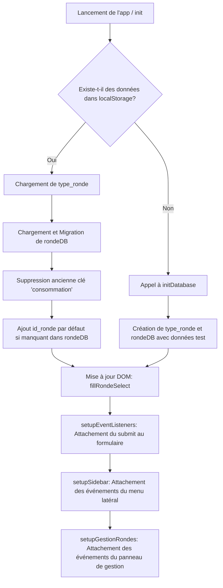
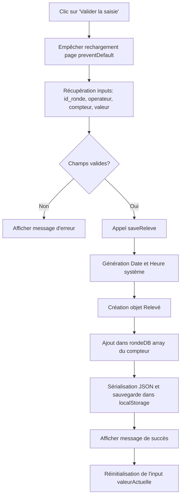
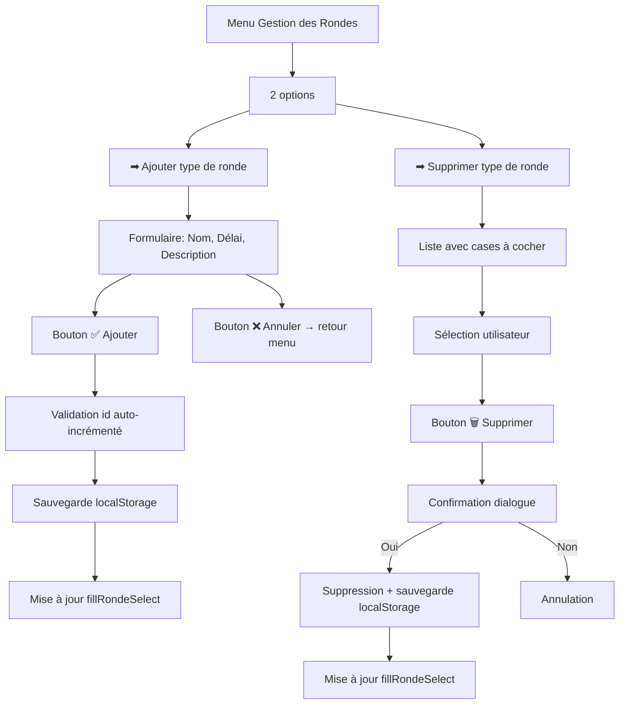

# Documentation Technique

Ce fichier détaille le fonctionnement interne de l'application, les algorithmes principaux, et donne un guide clair pour maintenir et améliorer le code existant.

---

## 1. Diagrammes de Flux (Mermaid)

### A. Initialisation de l'application (`init()`)



### B. Soumission d'un Relevé (`handleSubmit()`)



### C. Navigation dans le menu latéral (`setupSidebar()`)

```mermaid
graph TD
    A[Clic sur ☰] --> B[Ouverture sidebar + overlay]
    C[Clic sur × ou overlay] --> D[Fermeture sidebar + overlay]
    E[Clic sur un lien du menu] --> F[Fermeture sidebar]
    F --> G{Action = 'rondes'?}
    G -->|Oui| H[Afficher panneau gestionRondesMenu]
    G -->|Non| I[Afficher formulaire de relevé]
    I --> J[Afficher message "Fonctionnalité à venir"]
```

### D. Gestion des types de rondes



---

## 2. Description des Fonctions (`scripts.js`)

### Fonctions principales

- **`initDatabase()`** : Fonction de secours utilisée si le `localStorage` est vide. Elle pré-remplit `rondeDB` avec des relevés factices (datés de la veille) pour permettre de tester l'application directement.
- **`fillRondeSelect()`** : Génère dynamiquement les balises `<option>` de la liste déroulante "Type de ronde" en se basant sur le tableau `type_ronde`.
- **`saveReleve(id_ronde, id_operateur, id_compteur, valeur)`** : Cœur de la logique d'enregistrement. Elle récupère la date et l'heure courante du système, formate ces chaînes (`YYYY-MM-DD` et `HH:MM`), construit l'objet de données, l'ajoute au bon tableau dans `rondeDB` et pousse le tout dans le `localStorage`.
- **`showMessage(message, type)`** : Affiche une notification temporaire (3 secondes) en bas du formulaire (succès ou erreur) grâce à des classes CSS pré-existantes.
- **`resetFormAfterSubmit()`** : Ne vide intentionnellement que le champ `valeurActuelle`. Les listes déroulantes (Opérateur, Ronde, Compteur) conservent leurs sélections pour faciliter la saisie rapide en série d'une même ronde.
- **`handleSubmit(event)`** : Extrait les valeurs du DOM, s'assure qu'aucun champ n'est vide, et orchestre la sauvegarde et les retours visuels.
- **`loadSavedData()`** : Chargée de lire le `localStorage`. Intègre un **algorithme de migration de données** : si l'application lit des données créées par une ancienne version de l'application (qui contenait le champ `consommation` ou ne contenait pas `id_ronde`), elle nettoie les objets à la volée avant de les injecter dans la RAM.
- **`setupEventListeners()`** : Attache le gestionnaire d'événement `submit` au formulaire.

### Fonctions du menu latéral

- **`setupSidebar()`** : Configure l'ouverture/fermeture du menu latéral (bouton ☰, bouton ×, overlay). Gère le clic sur chaque lien du menu : redirige vers le panneau approprié ou affiche un message "Fonctionnalité à venir".
- **`showPanel(panelId)`** : Affiche un panneau spécifique (`gestionRondesMenu`, `ajouterRondePanel`, `supprimerRondePanel` ou `releveForm`) et masque tous les autres.

### Fonctions de gestion des rondes

- **`setupGestionRondes()`** : Configure tous les événements des panneaux de gestion des rondes (navigation entre sous-menus, boutons retour ←, boutons Annuler, Ajouter et Supprimer).
- **`ajouterRonde()`** : Lit les champs du formulaire d'ajout (nom, délai, description), calcule un `id_ronde` auto-incrémenté, ajoute l'objet dans `type_ronde`, sauvegarde dans `localStorage`, met à jour la liste déroulante et réinitialise les champs.
- **`renderRondesCheckList()`** : Génère la liste des rondes avec cases à cocher dans le panneau de suppression.
- **`supprimerRondesSelection()`** : Récupère les IDs des rondes cochées, demande confirmation, supprime les rondes sélectionnées de `type_ronde`, sauvegarde dans `localStorage`, met à jour la liste et la liste déroulante.

---

## 3. Guide de Maintenance et Mise à Niveau (Upgrade)

### Ajouter un nouvel Opérateur

**Actuellement les opérateurs sont figés dans le HTML.** Pour en ajouter :

1. Ouvrir `index.html`.
2. Repérer le `<select id="operateur">`.
3. Ajouter une nouvelle balise `<option value="Nom">Nom</option>`.

### Ajouter un nouveau Compteur

**Actuellement les compteurs sont figés.** Pour en ajouter :

1. Ouvrir `index.html`.
2. Repérer le `<select id="compteur">`.
3. Ajouter une nouvelle balise `<option value="nom_id">Label Affiché</option>`.
4. _Note :_ Aucune modification n'est requise dans `scripts.js`. La fonction `saveReleve` créera automatiquement le tableau `rondeDB["nom_id"]` si celui-ci n'existe pas encore.

### Ajouter ou modifier un Type de Ronde (via l'interface)

Depuis l'application :

1. Cliquer sur le bouton **☰** pour ouvrir le menu latéral.
2. Cliquer sur **🔄 Gestion des Rondes**.
3. Cliquer sur **➕ Ajouter type de ronde**.
4. Remplir le formulaire (Nom, Délai, Description) et cliquer sur **✅ Ajouter**.

### Supprimer un Type de Ronde (via l'interface)

Depuis l'application :

1. Cliquer sur le bouton **☰** pour ouvrir le menu latéral.
2. Cliquer sur **🔄 Gestion des Rondes**.
3. Cliquer sur **🗑️ Supprimer type de ronde**.
4. Cocher les rondes à supprimer et cliquer sur **🗑️ Supprimer la sélection**.
5. Confirmer la suppression dans la boîte de dialogue.

### Futures implémentations suggérées

- **Export des données** : Créer un bouton qui transforme `rondeDB` en fichier `.csv` ou `.json` pour le télécharger, vu qu'il n'y a pas de base de données backend.
- **Synchronisation réseau** : Ajouter un module `fetch()` pour envoyer les données au serveur quand une connexion internet est détectée.
- **Gestion dynamique des compteurs** : Créer un panneau d'administration similaire à "Gestion des Rondes" pour ajouter/supprimer des compteurs.
- **Gestion dynamique des opérateurs** : Créer un panneau d'administration pour ajouter/supprimer des opérateurs.
