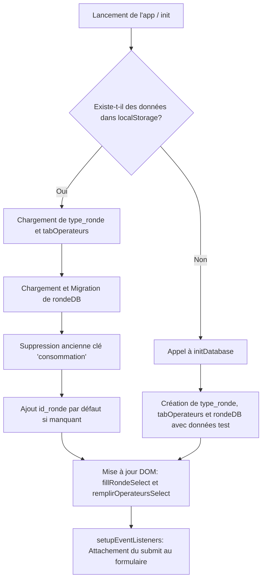
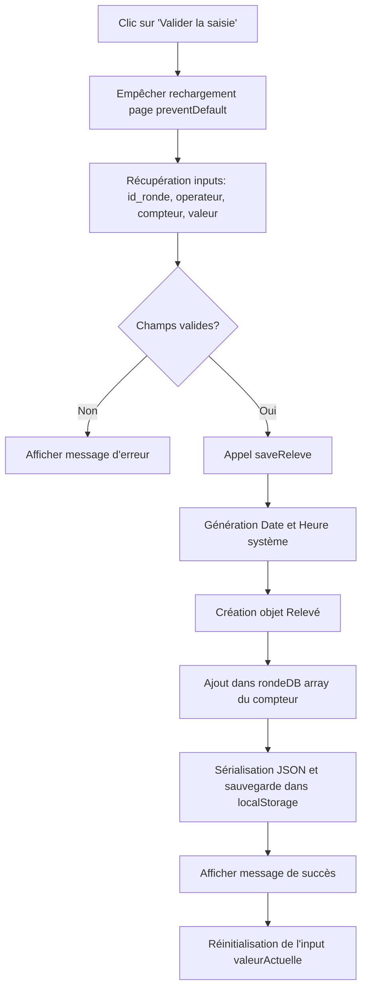

# Documentation Technique

Ce fichier détaille le fonctionnement interne de l'application, les algorithmes principaux, et donne un guide clair pour maintenir et améliorer le code existant.

---

## 1. Diagrammes de Flux (Mermaid)

### A. Initialisation de l'application (`init()`)

### B. Soumission d'un Relevé (`handleSubmit()`)

---

## 2. Description des Fonctions (`scripts.js`)

- **`initDatabase()`** : Fonction de secours utilisée si le `localStorage` est vide. Elle pré-remplit `rondeDB` avec des relevés factices (datés de la veille) pour permettre de tester l'application directement.
- **`fillRondeSelect()`** : Génère dynamiquement les balises `<option>` de la liste déroulante "Type de ronde" en se basant sur le tableau `type_ronde`.
- **`saveReleve(id_ronde, id_operateur, id_compteur, valeur)`** : Cœur de la logique d'enregistrement. Elle récupère la date et l'heure courante du système, formate ces chaînes (`YYYY-MM-DD` et `HH:MM`), construit l'objet de données, l'ajoute au bon tableau dans `rondeDB` et pousse le tout dans le `localStorage`.
- **`showMessage(message, type)`** : Affiche une notification temporaire (3 secondes) en bas du formulaire (succès ou erreur) grâce à des classes CSS pré-existantes.
- **`resetFormAfterSubmit()`** : Ne vide intentionnellement que le champ `valeurActuelle`. Les listes déroulantes (Opérateur, Ronde, Compteur) conservent leurs sélections pour faciliter la saisie rapide en série d'une même ronde.
- **`handleSubmit(event)`** : Extrait les valeurs du DOM, s'assure qu'aucun champ n'est vide, et orchestre la sauvegarde et les retours visuels.
- **`loadSavedData()`** : Chargée de lire le `localStorage`. Intègre un **algorithme de migration de données** : si l'application lit des données créées par une ancienne version de l'application (qui contenait le champ `consommation` ou ne contenait pas `id_ronde`), elle nettoie les objets à la volée avant de les injecter dans la RAM.

---

## 3. Guide de Maintenance et Mise à Niveau (Upgrade)

### Gérer les Opérateurs (via l'interface)

Depuis l'application :

1. Cliquer sur le bouton **☰** pour ouvrir le menu latéral.
2. Cliquer sur **👥 Gestion des opérateurs**.
3. Utiliser les sous-menus **➕ Ajouter opérateur**, **✏️ Modifier opérateur**, ou **🗑️ Supprimer opérateur**.

### Ajouter un nouveau Compteur

1. Ouvrir `index.html`.
2. Repérer le `<select id="compteur">`.
3. Ajouter une nouvelle balise `<option value="nom_id">Label Affiché</option>`.
4. _Note :_ Aucune modification n'est requise dans `scripts.js`. La fonction `saveReleve` créera automatiquement le tableau `rondeDB["nom_id"]` si celui-ci n'existe pas encore.

### Ajouter ou modifier un Type de Ronde

1. Ouvrir `scripts.js`.
2. Localiser la variable globale `type_ronde` au début du fichier.
3. Ajouter un nouvel objet dans le tableau en respectant le format :
   `{ id_ronde: X, ronde: "Nom", delai: "Minutes", description_ronde: "Description" }`
4. **Attention :** Si l'application a déjà été lancée sur le navigateur, `type_ronde` est stocké dans le `localStorage`. Pour forcer la mise à jour, il faut soit vider le cache, soit implémenter une fonction de mise à jour du `type_ronde` (actuellement le `localStorage` prime sur le code source).

### Futures implémentations suggérées

- **Export des données** : Créer un bouton qui transforme `rondeDB` en fichier `.csv` ou `.json` pour le télécharger, vu qu'il n'y a pas de base de données backend.
- **Synchronisation réseau** : Ajouter un module `fetch()` pour envoyer les données au serveur quand une connexion internet est détectée.
