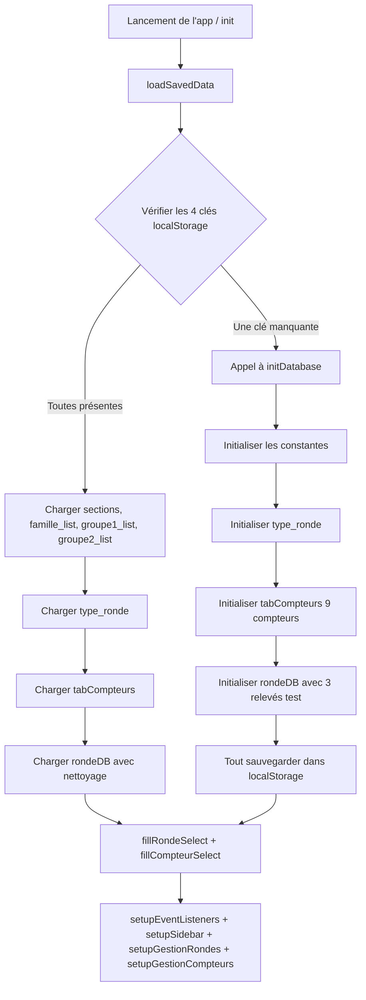
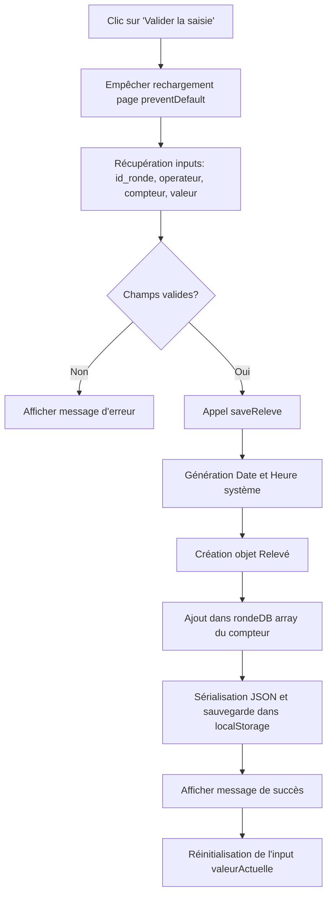
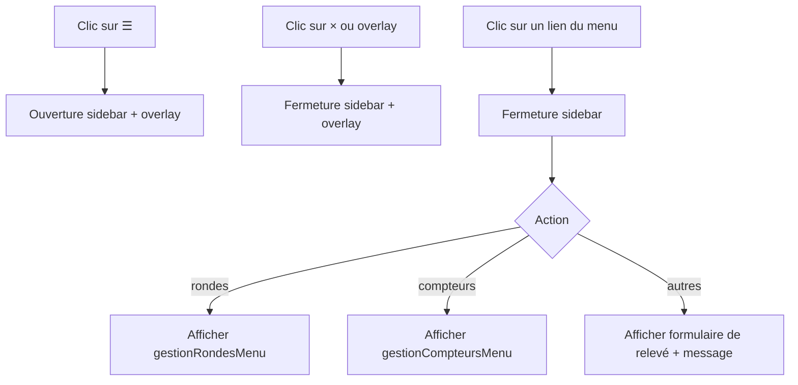
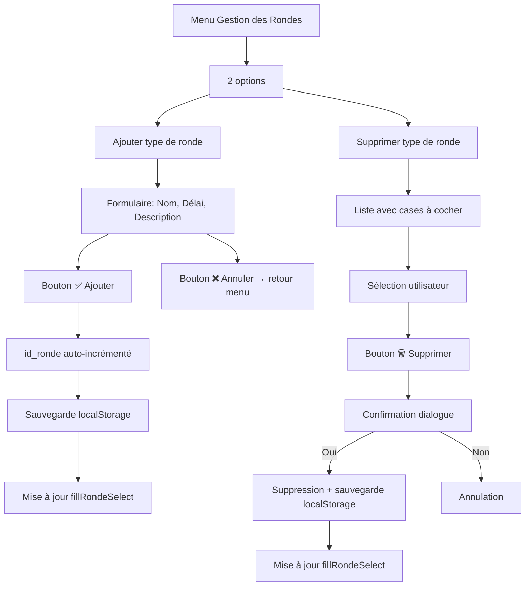
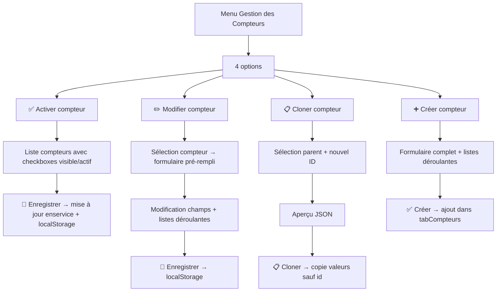

# Documentation Technique

Ce fichier détaille le fonctionnement interne de l'application, les algorithmes principaux, et donne un guide clair pour maintenir et améliorer le code existant.

---

## 1. Diagrammes de Flux (Mermaid)

### A. Initialisation de l'application (`init()` → `loadSavedData()` → `initDatabase()`)

### B. Soumission d'un Relevé (`handleSubmit()`)

### C. Navigation dans le menu latéral (`setupSidebar()`)

### D. Gestion des types de rondes

### E. Gestion des compteurs

---

## 2. Description des Fonctions (`scripts.js`)

### Fonctions d'initialisation et chargement

- **`initDatabase()`** : Fonction appelée uniquement au premier lancement (quand une des 4 clés localStorage est manquante). Initialise et sauvegarde toutes les données : constantes, type_ronde, tabCompteurs (9 compteurs), rondeDB (3 relevés test).
- **`loadSavedData()`** : Vérifie la présence des 4 clés (`sections`, `type_ronde`, `tabCompteurs`, `rondeDB`) dans localStorage. Si toutes présentes, charge les données. Sinon, appelle `initDatabase()`.
- **`init()`** : Point d'entrée de l'application. Appelle `loadSavedData()`, puis configure tous les event listeners.

### Fonctions utilitaires

- **`fillSelectFromArray(elementId, array, emptyOption)`** : Remplit un `<select>` avec un tableau de valeurs.
- **`fillRondeSelect()`** : Génère dynamiquement les `<option>` de la liste déroulante "Type de ronde".
- **`fillCompteurSelect()`** : Génère dynamiquement les `<option>` de la liste déroulante "Compteur". Filtre uniquement les compteurs visibles ET actifs.
- **`showMessage(message, type)`** : Affiche une notification temporaire (3 secondes).
- **`saveReleve(id_ronde, id_operateur, id_compteur, valeur)`** : Cœur de la logique d'enregistrement. Génère date/heure système, crée l'objet relevé, l'ajoute dans rondeDB et sauvegarde dans localStorage.

### Fonctions du menu latéral et navigation

- **`setupSidebar()`** : Configure l'ouverture/fermeture du menu latéral (bouton ☰, bouton ×, overlay). Gère le clic sur chaque lien du menu.
- **`showPanel(panelId)`** : Affiche un panneau spécifique et masque tous les autres. Gère 9 panneaux : releveForm, gestionRondesMenu, ajouterRondePanel, supprimerRondePanel, gestionCompteursMenu, activerCompteurPanel, modifierCompteurPanel, clonerCompteurPanel, creerCompteurPanel.

### Fonctions de gestion des rondes

- **`renderRondesCheckList()`** : Génère la liste des rondes avec cases à cocher (pour suppression).
- **`ajouterRonde()`** : Lit les champs du formulaire, calcule l'id_ronde auto-incrémenté, ajoute dans type_ronde, sauvegarde dans localStorage.
- **`supprimerRondesSelection()`** : Récupère les IDs cochés, demande confirmation, supprime les rondes, met à jour l'affichage.

### Fonctions de gestion des compteurs

- **`renderActiverCheckList()`** : Génère la liste de tous les compteurs avec badge de statut (✅ Actif & visible, 👁️ Actif mais invisible, ⏸️ Inactif) et checkboxes visible/actif.
- **`enregistrerActiver()`** : Met à jour les champs visible_compteur et actif_compteur, met à jour enservice_compteur en conséquence.
- **`remplirSelectModifier()`** : Remplit la liste déroulante de sélection pour "Modifier compteur".
- **`chargerCompteurDansFormModifier()`** : Charge les données du compteur sélectionné dans le formulaire de modification.
- **`enregistrerModification()`** : Enregistre les modifications d'un compteur.
- **`remplirSelectCloner()`** : Remplit la liste déroulante de sélection pour "Cloner compteur".
- **`afficherApercuClone()`** : Affiche un aperçu JSON du clone.
- **`executerClonage()`** : Crée un clone d'un compteur (copie toutes les valeurs sauf id_compteur).
- **`creerCompteur()`** : Crée un nouveau compteur à partir du formulaire.
- **`setupGestionCompteurs()`** : Configure tous les événements des panneaux de gestion des compteurs.

---

## 3. Structure du stockage localStorage

| Clé            | Type     | Description                                          |
| -------------- | -------- | ---------------------------------------------------- |
| `sections`     | `Array`  | 9 sections (Salle Des Machines, Embouteillage, etc.) |
| `famille_list` | `Array`  | 7 familles (Eau, Energie, DDO, etc.)                 |
| `groupe1_list` | `Array`  | 9 groupes (A, B, C, D, E, F, G, H, I)                |
| `groupe2_list` | `Array`  | 9 groupes (1, 2, 3, 4, 5, 6, 7, 8, 9)                |
| `type_ronde`   | `Array`  | Types de rondes (journalier, quart, etc.)            |
| `tabCompteurs` | `Array`  | 9 compteurs avec tous leurs champs                   |
| `rondeDB`      | `Object` | Relevés par compteur (clé = id_compteur)             |

---

## 4. Guide de Maintenance et Mise à Niveau (Upgrade)

### Ajouter un nouvel Opérateur

1. Ouvrir `index.html`.
2. Repérer le `<select id="operateur">`.
3. Ajouter une nouvelle balise `<option value="Nom">Nom</option>`.

### Ajouter un nouveau Compteur (via l'interface)

1. Cliquer sur **☰** → **🔢 Gestion des compteurs** → **➕ Créer compteur**.
2. Remplir le formulaire et cliquer sur **✅ Créer**.

### Ajouter un Type de Ronde (via l'interface)

1. Cliquer sur **☰** → **🔄 Gestion des Rondes** → **➕ Ajouter type de ronde**.
2. Remplir le formulaire et cliquer sur **✅ Ajouter**.

### Réinitialiser les données

Pour forcer la réinitialisation au premier lancement :

1. Ouvrir la console navigateur (F12).
2. Taper `localStorage.clear()` et recharger la page.

### Futures implémentations suggérées

- **Export des données** : Créer un bouton qui transforme `rondeDB` en fichier `.csv` ou `.json` pour le télécharger.
- **Synchronisation réseau** : Ajouter un module `fetch()` pour envoyer les données au serveur quand une connexion internet est détectée.
- **Gestion dynamique des opérateurs** : Créer un panneau d'administration pour ajouter/supprimer des opérateurs.
- **Tableau de bord** : Ajouter des statistiques sur les relevés (consommation, tendances, etc.).
